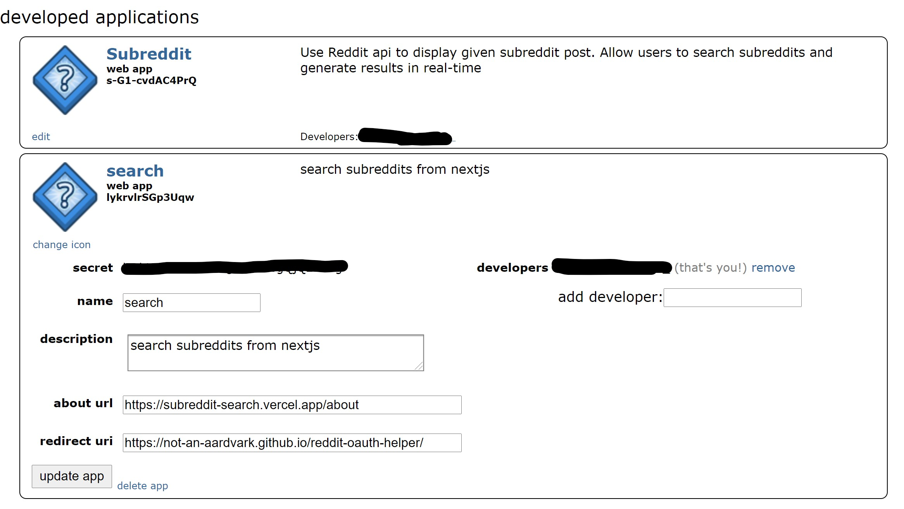
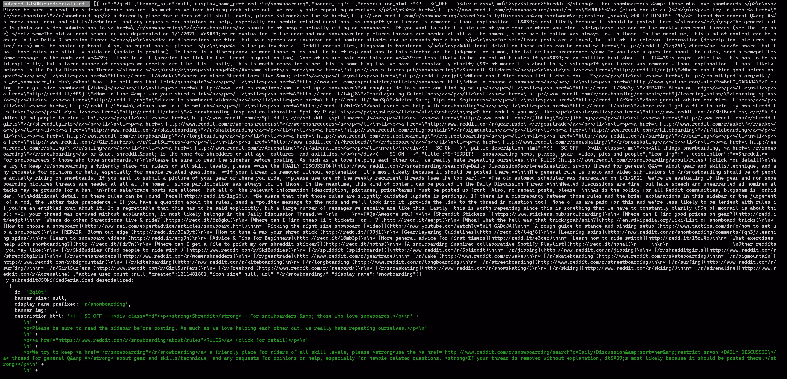
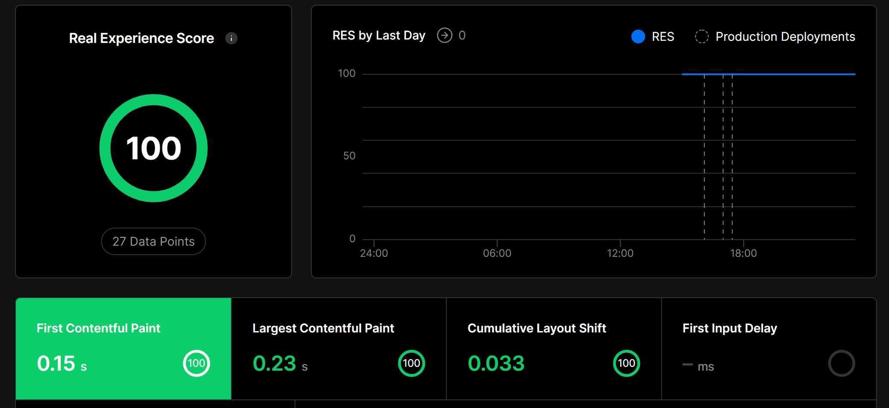

## [Deployed App](https://r-weld.vercel.app)

## Installing and running this repo

- Install the dependencies in this repo with yarn. I left husky in rather than adding it to the .gitignore file as the transition from v4-v5 occurred about a week ago (now shell scripted rather than written as a hook in package.json).

## Use [Snoowrap](https://github.com/not-an-aardvark/snoowrap) api for node

- https://www.reddit.com/dev/api/#GET_subreddits_popular
- https://github.com/not-an-aardvark/snoowrap/issues/219
- https://github.com/not-an-aardvark/snoowrap

## [About Reddit API Access](https://www.reddit.com/wiki/api#wiki_reddit_api_access)

## [Sign up for usage](https://docs.google.com/a/reddit.com/forms/d/1ao_gme8e_xfZ41q4QymFqg5HD29HggOD8I9-MFTG7So/viewform)

## [Configure Access to Reddit API](https://www.reddit.com/prefs/apps)

- when registering your app, be sure to set the redirect uri to https://not-an-aardvark.github.io/reddit-oauth-helper/
- This is to use snoowrap Oauth helper for generating a token using the clientID and clientSecret generated from signing up

### Reddit App policy change

- On the weekend of March 12th, Reddit changed their app policy and disallow any apps containing the name `reddit` in them now. Therefore I had to generate new credentials when working with a root `oauth_config.json` file

#### oauth_config.json conundrum

- The oauth_config.json file, when contained in the root, has the following values:

```json
{
	"client_id": "xxxxxxxx",
	"client_secret": "xxxxxxxxxxxxxxxxxxxxxxxxxxxxx",
	"refresh_token": "xxxxxxxxxxxxxxx-xxxxxxxxxxxxxxxxxxxxxxxxxx",
	"user_agent": "Mozilla/5.0 (Windows NT 10.0; Win64; x64) AppleWebKit/537.36 (KHTML, like Gecko) Chrome/88.0.4324.152 Safari/537.36"
}
```

- note how the above values differ from the credentials initially provided? Namely, the client_id and client_secret values. The alteration of the pattern for these raw values may be reflective of the shift in Reddit's policy.



- That said, to execute the `test/index.test.tsx` test successfully, this root json file must be added. After adding the file, make the following changes to the `lib/snoo-config.ts` file

```ts
import snoowrap, { SnoowrapOptions } from 'snoowrap';
import secrets from '../oauth_config.json';
const snoowrapOptions: SnoowrapOptions = {
	clientId: secrets.client_id,
	clientSecret: secrets.client_secret,
	userAgent: secrets.user_agent,
	refreshToken: secrets.refresh_token
};
export const r = new snoowrap(snoowrapOptions);
```

- Finally, import the json file into `pages/_app.tsx` as follows

```tsx
import '../styles/index.css';
import '../styles/chrome-bug.css';
import 'keen-slider/keen-slider.min.css';
import '../oauth_config.json';
// ...
```

- While this does allow page-level tests to execute successfully, it interferes with getInitialProps. My next step is to incorporate getInitProps in the \_app file in an effort to resolve this problem (it also causes vercel builds to fail).

- To get your unique NEXT_PUBLIC_USER_AGENT, follow the instructions [found here in the official Next documentation](https://nextjs.org/docs/api-reference/data-fetching/getInitialProps#typescript)

### Jest Quirks

- The tests in this repo reside in the root `test` directory. That said, there are some quirks associated with configuring the test suite to run perfectly. Therefore, I will outline how to configure a testing environment since the `snoowrap` library complicates things with its `oauth_info.json` file required for testing. The presence of this file alters the behavior of the snoowrap fetcher. I spent my Saturday and Sunday evenings trying to resolve how exactly my serializations/deserializations in index.tsx and /r/[display_name].tsx were no longer acceptable. It left me a bit baffled, so I grapped the most recent working version from just before adding said config file to the root. I have not added it since yet mimicked all the other changes I made globally. The app still functions as intended, thought it is a bit peculiar that it is throwing an error about `Unexpected token u in JSON at position 0` in JSON _only_ in the presence of said configuration file 🤔
- This leaves me to believe that it _must_ be a getIntialProps issue, and that having this config file be scooped up by \_app and lib/snoo-config alike delays the init population of these values, even if only by 50-100ms.

### JEST UPDATE -- 04/15/21
- simply add this code to the top of the `test/testUtil.ts` file for seamless .env.testing support
```ts
import { loadEnvConfig } from '@next/env';

export default async () => {
	const projectDir = process.cwd();
	loadEnvConfig(projectDir);
};
```
### Compiling code

- To compile the code, run

```git
yarn build
```

- To compile the code and generated server/client bundles in the browser to analyze, run

```git
yarn analyze
```

- To run tests, run

```git
yarn test
```

- To run linting, type checking, and tests, run

```git
yarn test-all
```

- To replicate a vercel production environment locally, run

```git
yarn vercel dev
```

- To execute all of the husky-mediated precommit tasks, run

```git
git add . && git commit -m "message"
```

### Notes about this project

- Syncing audio with video proved to be a difficult task, which is evident upon inspection of the root `UI.md` file

### Pagination

- I attempted many methods regarding pagination, everything from custom approaches to SWR hooks to smuggling a `fetchMore` handler from getStaticProps into the client -- none of which succeeded when using getStaticProps+ISR -- something I was determined to achieve. However. I am currently implementing a SSR approach using react-pagination and that should be live soon (the latter being the method defaulted to for the sake of simplicity). 
- _That said_, I was able to achieve "pagination" with `Keen Slider`, though that made for a less than ideal UX especially on mobile as all 10 of the displayed posts could be swiped from side to side, often with little effort. If you import Keenslider into `pages/r/[display_name].tsx` and wrap the submissions as follows

```tsx
<SubredditPost
	key={p.id}
	icon_size={p.icon_size}
	banner_size={p.banner_size}
	banner_img={p.banner_img}
	icon_img={p.icon_img}
	public_description_html={p.public_description_html}
	title={p.title}
	description_html={p.description_html}
	display_name_prefixed={'/' + p.display_name_prefixed}
	active_user_count={activeUsers.active.toLocaleString()}
	id={p.id}
	description={p.description ?? ''}
	display_name={p.display_name}
>
    <Keenslider>
        <>
	        {SubmissionPostOptions}
        </>
    <Keenslider>
	<LoadMore />
</SubredditPost>
```

- then you should be able to achieve the same result with minimal tweaking to the css. I have used keen slider in other projects before but most frequently for things such as testimonials as opposed to 10 vertically aligned posts.

- Chances are good that I will resolve pagination over the next days or so as I was close with one custom method in particular but ran out of time. The reason `snooSubmissions.tsx` is still there is because it does indeed return data for more submissions, I've embedded it using `<pre></pre>` tags at the bottom of subreddits and confirmed it's in working order via Postman. The challenge therein being that it was necessary to switch fallback from `true` to `blocking` to avoid a `getInitialProps` mediated error on initial render.

- The `types/json.ts` file are helper typedefs I put together to resolve passing JSON from server to client in a typescript environment

- as you can see in the screenshot below, the white block of text is the serverside-consolodiated serialized/jsonified/noundefined mass whereas the green output is the clientside recipient deserializing that same mass back into its original form



- In retrospect, I might approach this project with an apollo microserver and apollo client since (a) that's my comfort zone and (b) the reddit api proved less organized than anticipated, so I ended up making custom types regardless. I am glad, however, that I was able to explore handling JSON data in a typescript environment this intricately. The notion of fully utilizing the getStaticProps mediated donation of data from the server to the client via inferring getStaticProps in a more hands-on way intrigued me. That was ultimately my favorite part of this exercise, and it showed in the analytics as far as bundle size and time to first paint are concerned.


